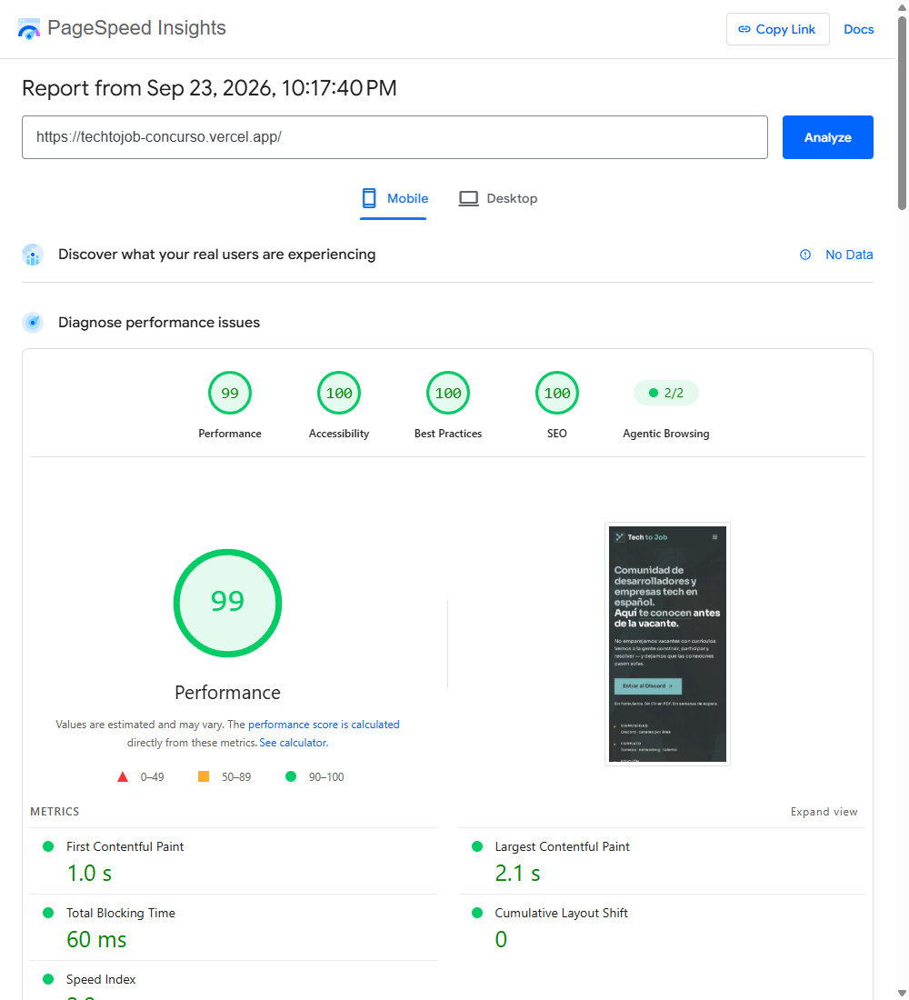
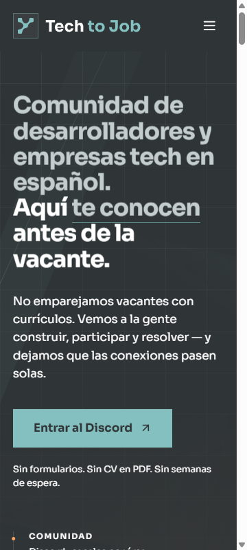
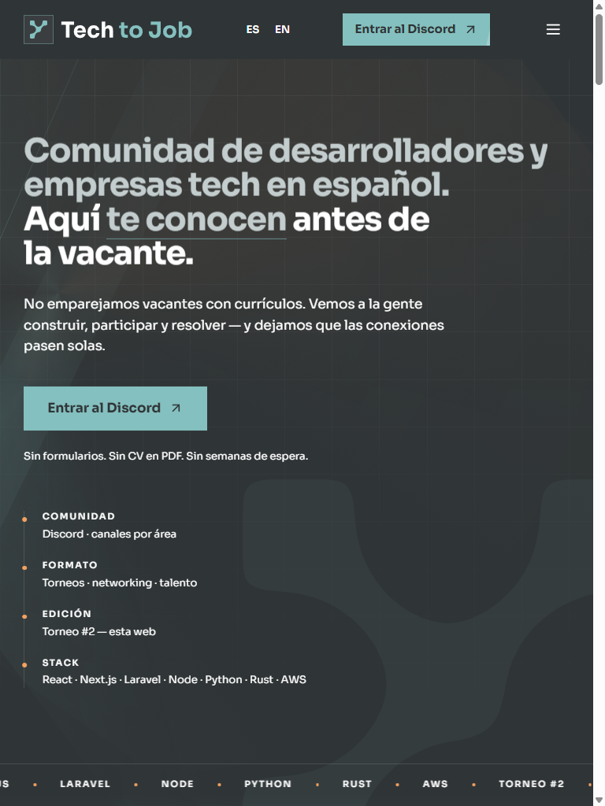
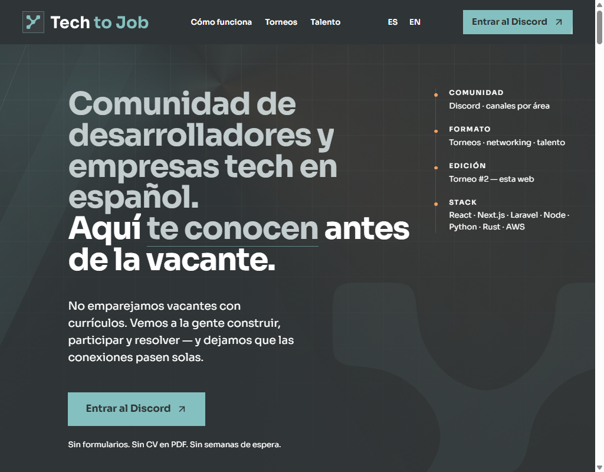
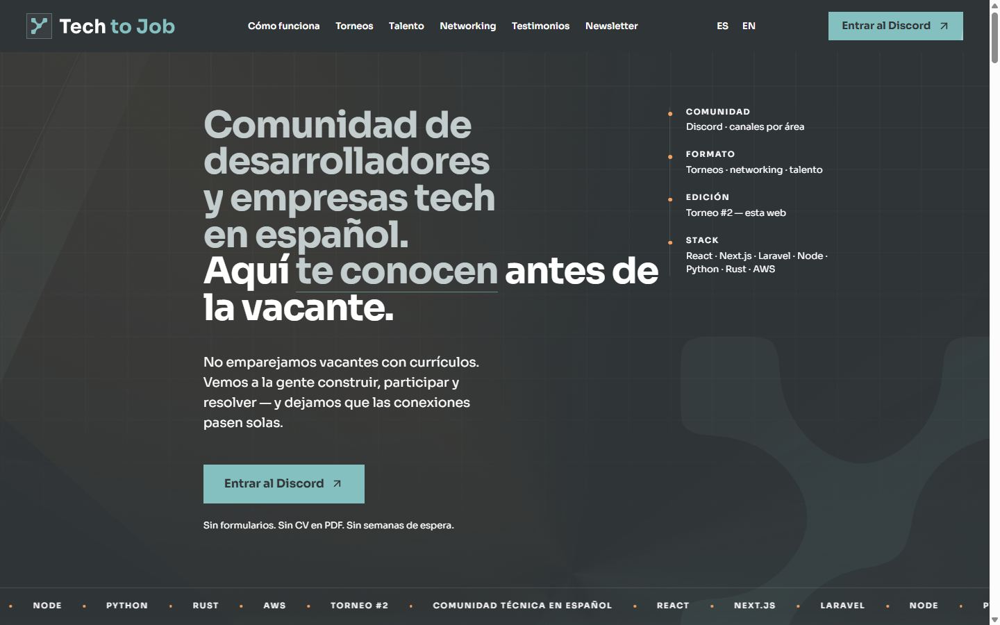
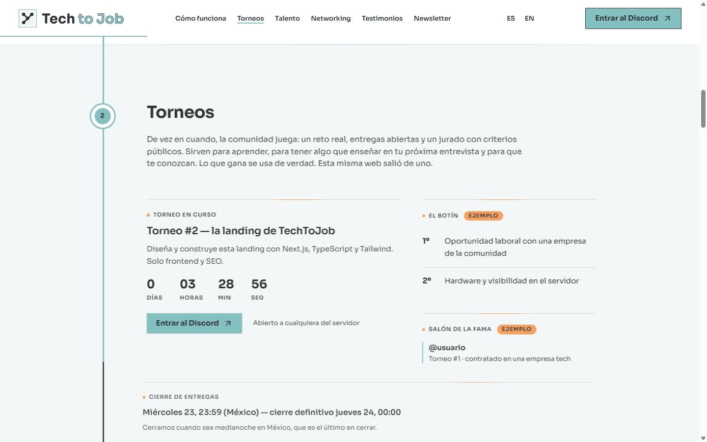
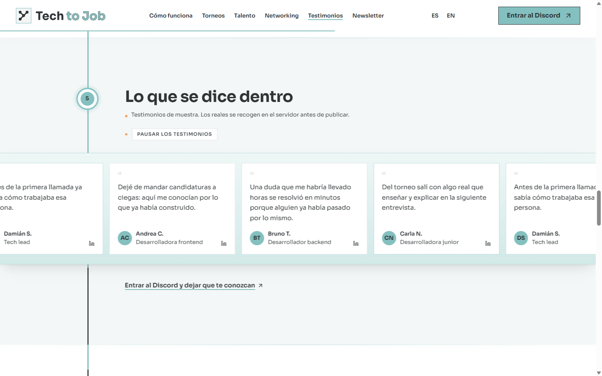
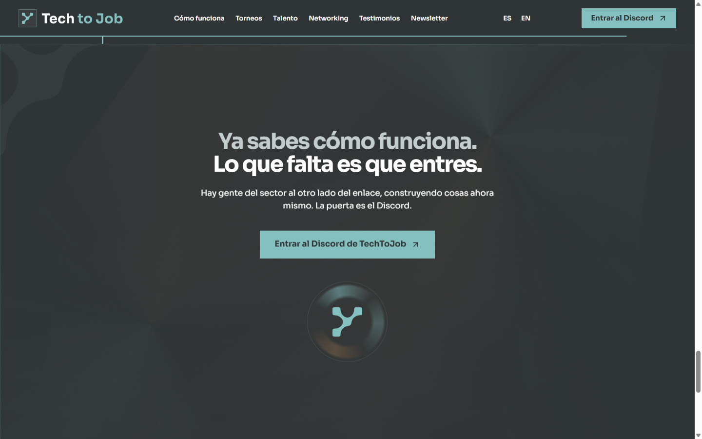

# TechToJob — Tournament #2 Landing Page

Landing page for **TechToJob**, a community of Spanish-speaking developers and tech companies.
This site is **Lorena Salas**'s entry to the community's **Tournament #2**: the prize is a job
offer and the technical challenge is the website itself.

> **It is not a job board. It is a community.**
> [Join the Discord](https://discord.gg/h9FFgKdkRd) · Live site: [techtojob-concurso.vercel.app](https://techtojob-concurso.vercel.app)

## Stack

- **Next.js 16** (App Router) · Server Components by default, only 3 justified client components (adaptive header, countdown and newsletter form)
- **Strict TypeScript** · no `any`, clean `tsc --noEmit`
- **Tailwind CSS v4** · design tokens in `@theme`, no hand-written CSS, no UI kits
- Pure frontend + technical SEO: no backend, no server APIs, no third-party trackers

## Run locally

```bash
cd app
npm install
npm run build && npm start   # http://localhost:3000 (local production build)
# or in development:
npm run dev
```

## What the landing contains

Hero with a single CTA (join the Discord) → How it works (4 steps) → Tournaments (with a closing
countdown) → Audiences (talent and companies as two parallel paths) → Networking → Testimonials
(samples, with an honest LinkedIn slot) → News (declared mockup) → Newsletter → Closing → Footer
with link blocks.

**About the order (R10):** the rules leave the body order open and only fix the hero first and the
footer last. It was reordered on purpose so the page reads as a **vertical timeline**: first *how it
works*, then the live proof (the running tournament), then what each side gains (talent / companies),
the community, the validation, the news and the closing. The real order lives in
`app/app/[locale]/page.tsx` and the rationale is recorded in `docs/DECISIONES.md` (D32, D38).

## Internationalization (ES / EN)

- **Spanish at `/`** (main language and canonical) and **`/en`** for the English version. While the
  EN catalog is a mirror of ES, `/en` stays reachable but **`noindex`** and out of the `sitemap`
  (this avoids advertising an `hreflang` whose language does not match); each route's `lang` is correct.
- The header language selector is a **real link** (`<a href>`, no JavaScript, no state), as the rules ask.
- All visible text lives in `app/messages/es.json` and `app/messages/en.json`, never inline in the
  components; the types check that both catalogs have exactly the same keys.

> **Translation status:** `/en` currently serves **the same Spanish content** (the EN catalog is a
> mirror of ES, a *declared placeholder*). The bilingual infrastructure is complete and tested; the
> translation is a pending copy task that **needs no code changes**. To ship it, translate `en.json`
> and revert the `noindex` + the `sitemap` entry (a 2-line change, documented in `specs/12-i18n.md`
> → *Translation handoff*).

## Verified quality

| Gate | Status |
|---|---|
| `next build` + `tsc --noEmit` + ESLint | ✅ 0 errors |
| Contest's 61 rules audit | ✅ initial (22/09) + review (23/09) — `docs/qa/2026-09-22-rules-audit-1.md`, `docs/qa/2026-09-23-auditoria-revision.md` |
| `rules-auditor` + `seo-perf` + `qa-access` | ✅ run in review mode (`docs/qa/2026-09-23-auditoria-revision.md`) |
| Mobile Lighthouse on the deploy | ✅ PageSpeed Insights: **Perf 99 · SEO 100 · Accessibility 100 · Best Practices 100** (`docs/qa/2026-09-23/`) |
| Responsive 360 / 768 / 1024 / 1440 | ✅ captures on the deploy in `docs/qa/2026-09-23/` |
| Technical SEO: Metadata API + canonical/viewport (R49–R50), Open Graph + Twitter Card 1200×630 (R51), JSON-LD Organization (R52), sitemap + robots | ✅ verified on the deploy (`<head>`, `/sitemap.xml`, `/robots.txt`) |
| WCAG 2.1 AA: semantics, single H1, contrast, keyboard, `prefers-reduced-motion` | ✅ (Lighthouse Accessibility 100) |

## Evidence (on the deploy)

**Mobile Lighthouse — PageSpeed Insights (Lighthouse running on Google servers): Performance 99 · Accessibility 100 · Best Practices 100 · SEO 100**



**Responsive captures (360 / 768 / 1024 / 1440):**

| Mobile 360 | Tablet 768 | Desktop 1024 | Desktop 1440 |
|---|---|---|---|
|  |  |  |  |

**Detail of the strongest sections (1440):**

| Tournaments (live tournament + countdown) | Testimonials (slider over the timeline) | Closing ("the door" + seal) |
|---|---|---|
|  |  |  |

> Full reports (JSON/HTML) and decisions in `docs/qa/` and `docs/DECISIONES.md`.

## Repo map

| Folder | Contents |
|---|---|
| `app/` | The Next.js site (all the code) |
| `specs/` | Specs derived from the rules: 61-rule checklist, landing spec, content, technical requirements, rubric |
| `docs/` | Decisions (`DECISIONES.md`), design system, dated QA evidence |
| `AGENTS.md` · `GUIA.md` · `.opencode/` | The multi-agent system used to build and audit this repo |

## AI usage disclosure (required by the rules)

This project was built with a purpose-made multi-agent system (6 orchestrated roles: spec, design,
build, SEO, accessibility QA and rules auditor — defined in `.opencode/agent/`). The agents wrote
and audited code against specs derived from the contest rules; product direction, copy decisions and
the final review are human. The whole process is auditable in the commit history and in `docs/`.

> **Final verification:** before submitting, a review pass was run with `rules-auditor`, `seo-perf`
> and `qa-access` over the frozen state; its findings and fixes are in
> `docs/qa/2026-09-23-auditoria-revision.md` and `docs/DECISIONES.md`.

## Sources and credits

- **Logo**: official brand kit provided by TechToJob (`app/public/brand/`). Variants are served
  **unmodified**. Three files are **documented derivatives** over the official outlines (same
  `viewBox`, only fills change), used in the header composite: `wordmark-duo.svg` (D31),
  `wordmark-ink.svg` (D55) and `wordmark-ink-duo.svg` (D97).
- **Typeface**: Sora (Google Fonts, OFL) loaded with `next/font`; weights 400/600/700.
- **Icons**: hand-written SVGs in `app/components/icons.tsx` (no libraries).
- **Palette**: carbon `#2f3436`, green `#84c0bf`, white `#ffffff` + grays and one accent, per the brief.
- **Copy**: 100% original, grouped in `app/messages/es.json` and `app/messages/en.json` (texts kept
  separate from code; the EN catalog is pending translation, see above).
- **Testimonials and news**: mockups honestly labeled as such (the brief asks for a mockup, not invented data).

Design and content by **Lorena Salas** · Tournament #2 website for TechToJob.
